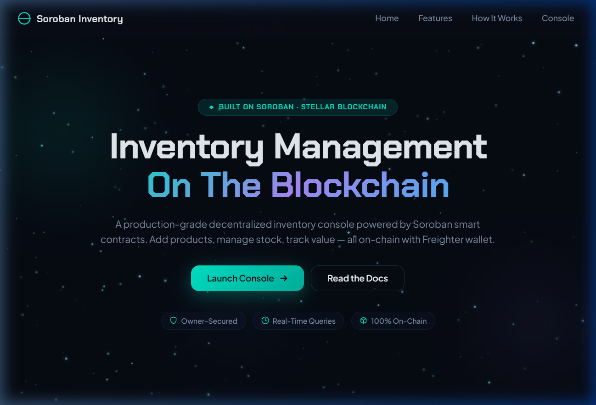
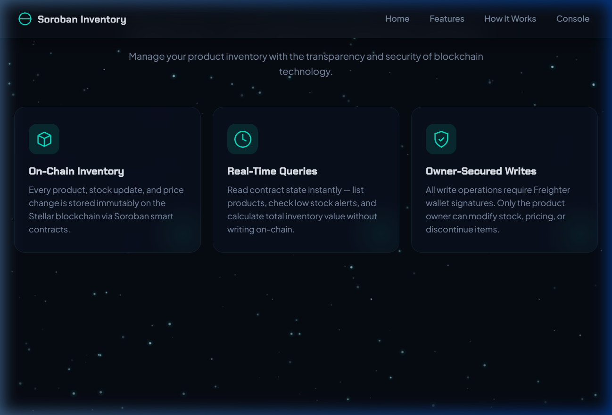
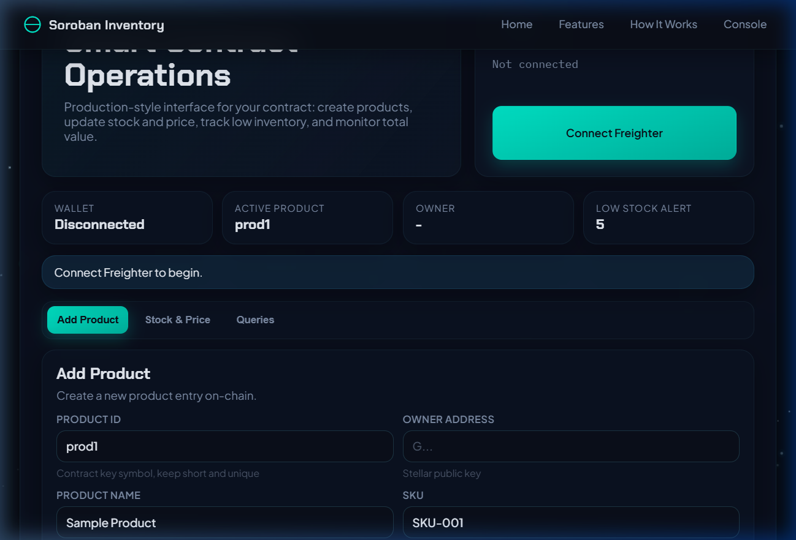

<div align="center">
  
  <h1>Soroban Inventory dApp</h1>
  <p>A production-grade, immersive Web3 Inventory Management System built on Stellar's Soroban Smart Contracts, featuring a cinematic 3D animated landing page.</p>

  <p>
    <a href="#quick-start"><b>Quick Start</b></a> • 
    <a href="#system-architecture"><b>Architecture</b></a> • 
    <a href="#tech-stack"><b>Tech Stack</b></a> • 
    <a href="#detailed-setup-guide"><b>Setup Guide</b></a>
  </p>
</div>

---

## 🌟 Overview

The **Soroban Inventory dApp** is a next-generation decentralized application (dApp) for supply chain and inventory management. This project demonstrates a seamless integration between a modern, highly-interactive frontend (built with React, Vite, and GSAP) and Web3 blockchain infrastructure (Stellar SDK, Freighter Wallet, and Soroban Smart Contracts).

The UI has undergone a complete **dark cosmic glassmorphism overhaul**, creating a premium, cinematic experience with scroll-triggered 3D animations and particle effects.

---

## 📸 Screenshots & Demo

### Scroll Animations Demo


<p align="center">
  
  
</p>
<p align="center">
  
</p>

---

## 🏗️ System Architecture

The project follows a standard **Full-Stack Web3 Architecture**, where the frontend directly communicates with a Soroban Smart Contract deployed on the Stellar Testnet. 

### 1. Frontend Layer (React + Vite)
- **User Interface:** Written in React. Uses a single-page architecture where users navigate through cinematic scroll sections before reaching the main dashboard.
- **Styling:** Custom Vanilla CSS utilizing CSS Grid, Flexbox, glassmorphism (`backdrop-filter`), and CSS variables for a consistent "dark cosmic" theme.
- **Animations:** Powered by **GSAP** (GreenSock Animation Platform) and its `ScrollTrigger` plugin. Features 3D tilt cards, parallax starfield, animated counters, and staggered reveals.

### 2. Web3 / Integration Layer (Stellar SDK)
- **Connection provider:** `@stellar/stellar-sdk` and `@stellar/freighter-api`.
- **Wallet Connection:** Users connect their Freighter Wallet (browser extension). The dApp reads the user's public key to authorize inventory transactions.
- **Transaction Builder:** When a user interacts with the UI (e.g., "Add Product" or "Update Stock"), the app utilizes `TransactionBuilder` to encode arguments into XDR format and requests a signature from the Freighter wallet.
- **Simulation & Read:** Querying the contract (e.g., getting product details or calculating total value) uses non-state-changing simulations via `invokeRead` that cost 0 stroops, providing fast and free data retrieval.

### 3. Smart Contract Layer (Soroban / Rust)
- **Deployment:** The Soroban smart contract is deployed on the Stellar Testnet.
- **State Management:** The contract maintains the ledger state of all products, mapped by unique identifiers (SKUs), owner addresses, quantities, and prices.
- **Methods:** 
  - `add_product`
  - `update_stock`
  - `update_price`
  - `discontinue_product`
  - `get_product`
  - `list_products`
  - `get_low_stock`
  - `get_total_value`

### End-to-End Flow Example: Adding a Product
1. **User Action:** The user fills out the "Add Product" form in the UI.
2. **Frontend Encoding:** `stellar.js` takes the input, encodes parameters (like `id` into `Symbol`, `quantity` into `u32`, `price` into `i128`), and creates a Transaction envelope.
3. **Wallet Interaction:** Freighter Wallet pops up, asking the user to sign and approve the transaction fee.
4. **Network Submission:** If approved, the transaction is submitted to the Stellar Testnet via the RPC server.
5. **Confirmation:** The frontend polls the network until the transaction confirms, and then updates the UI.

---

## 🛠️ Tech Stack

- **Framework:** [React 19](https://react.dev/) + [Vite 8](https://vitejs.dev/)
- **Animations:** [GSAP](https://gsap.com/) & ScrollTrigger
- **Styling:** Vanilla CSS, Glassmorphism, CSS Variables
- **Blockchain:** [Stellar SDK](https://developers.stellar.org/docs/tools/sdks/library/javascript-stellar-sdk), [Freighter API](https://docs.freighter.app/)
- **Smart Contracts:** Soroban (Rust)

---

## ⚙️ Detailed Setup Guide

If you want to run this project locally or extend it, follow these detailed steps.

### Prerequisites

1. **Node.js**: Ensure you have Node.js 18+ installed. Check with:
   ```bash
   node -v
   ```
2. **Freighter Wallet**: Install the [Freighter browser extension](https://www.freighter.app/).
3. **Stellar Testnet Account**: Create an account in Freighter and switch to the **Testnet** network. You can fund your account using the [Stellar Laboratory Faucet](https://laboratory.stellar.org/#account-creator?network=test).

### 1. Clone the Repository

```bash
git clone https://github.com/subrata7159-coder/stellar-inventory-dapp.git
cd stellar-inventory-dapp
```

### 2. Install Dependencies

Install the required NPM packages. 

```bash
npm install
```
*Note: This project uses `vite-plugin-node-polyfills` to ensure `@stellar/stellar-sdk` works smoothly in a modern browser environment without issues related to `Buffer` or `process`.*

### 3. Configure Smart Contract Addesses

If you intend to use the existing deployed contract, no action is needed.
If you deploy your own Soroban contract, you must update the IDs in `lib/stellar.js`:

```javascript
// In lib/stellar.js:
export const CONTRACT_ID = "YOUR_CONTRACT_ID_HERE";
export const DEMO_ADDR = "YOUR_PUBLIC_KEY_HERE";
```

### 4. Run the Development Server

Start the local Vite development server:

```bash
npm run dev
```

The application will be available at `http://localhost:5173`. 

### 5. Build for Production

To create an optimized production build:

```bash
npm run build
```
This will compile the React code, optimize GSAP dependencies, and output the static files into the `dist/` directory.

---

## 📁 Folder Structure

```
stellar-inventory-dapp/
├── public/                 # Static assets (including logo.png)
├── src/                    # Main source code
│   ├── components/         # Reusable React components
│   │   ├── Features.jsx    # 3D Tilt cards section
│   │   ├── HowItWorks.jsx  # Animated steps section
│   │   ├── LandingHero.jsx # Hero section with 3D text
│   │   ├── Navbar.jsx      # Navigation bar
│   │   ├── Starfield.jsx   # Canvas particle background
│   │   └── StatsSection.jsx# Animated numbers
│   ├── App.jsx             # Main application layout and Console UI
│   ├── App.css             # Main styling, dark theme, and glassmorphism
│   ├── index.css           # Global resets and smooth scrolling
│   └── main.jsx            # React root and global polyfills
├── lib/
│   └── stellar.js          # Core logic for Soroban contract interaction
├── contract/               # (Optional) Rust source code for the Soroban smart contract
├── package.json            # Project dependencies and scripts
└── vite.config.js          # Vite configuration with node-polyfills
```

---

<div align="center">
  <p>Built on <a href="https://stellar.org/soroban">Stellar & Soroban</a></p>
</div>
